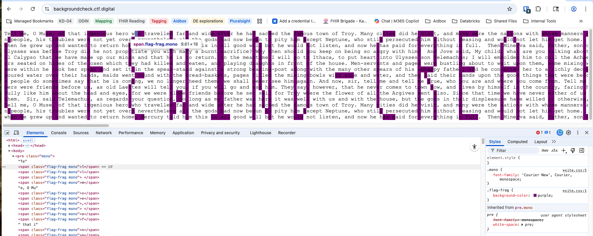

# Background Check

## Challenge

The webpage appears to have the start of the Odyssey text.

## Solution

The title, **“Background Check,”** hints that something important is hidden in the page’s styling.

Inspecting the page source reveals several elements with a CSS class named **`flag-frag`**. At first glance, these fragments don’t appear on the page.

Checking the CSS shows why:

```css
.flag-frag {
    background-color: white;
}
```

Changing the color (e.g., to purple) makes the hidden flag visible: `ctf{wind-create-nebula-crane}`


