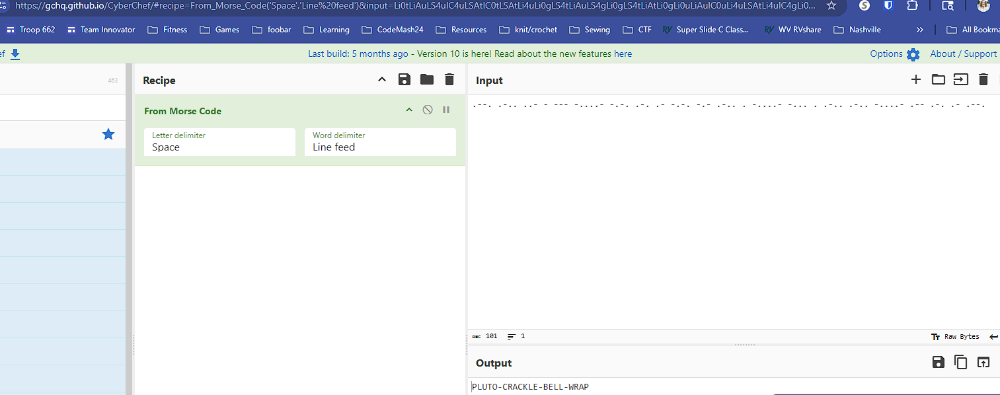

# Blinky

## Challenge Summary
A GIF with a single blinking dot encoded a hidden message. The timing of each frame represented Morse code.

### Step 1 — Extract the GIF Frames
I split the GIF into individual frames using an online GIF‑to‑frames tool (e.g., ezgif.com’s **Split** tool).

Each frame showed either:
- a **bright dot**, or  
- a **dark dot**

The key information was the **delay time** associated with each frame.

### Step 2 — Interpret Timing as Morse
The challenge used frame duration to encode Morse:

- **3‑second bright frame → DOT (·)**  
- **9‑second bright frame → DASH (–)**  
- **3‑second dark frame → letter space**
- **9‑second dark frame → word space**

I stepped through the frames in order, recording dots, dashes, and spaces based on these rules.

### 🥉 Step 3 — Build the Morse Sequence
After processing all frames, I had the full Morse string and used [CyberChef](https://gchq.github.io/CyberChef/) to decode it:

