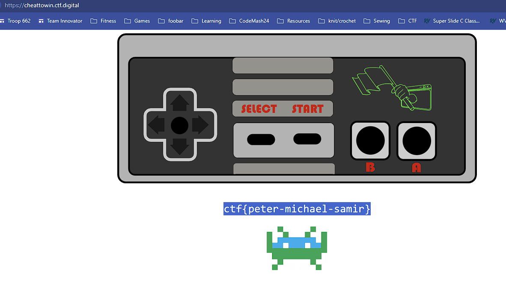

# Cheat to Win

## Challenge Summary

Given a description with コナミグループ株式会社 and a site with an old Nintendo controller.

## Solution

Googling コナミグループ株式会社 see it's Konami Corporation.

The Konami Code is a famous video game cheat sequence: Up, Up, Down, Down, Left, Right, Left, Right, B, A, Start.

Entering this in the controller reveals the flag.

