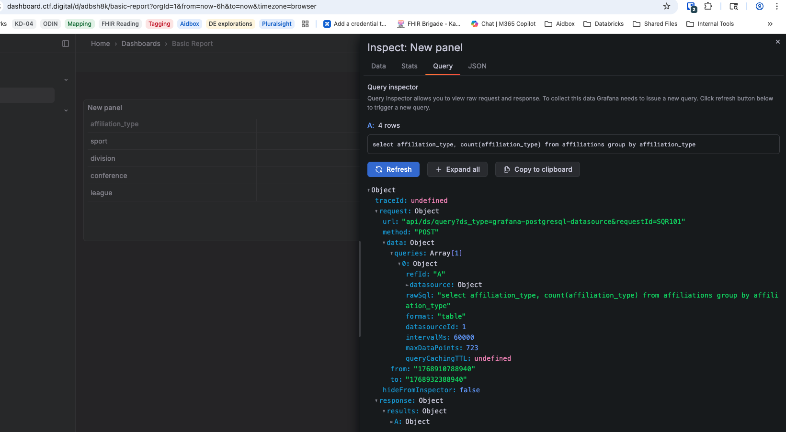
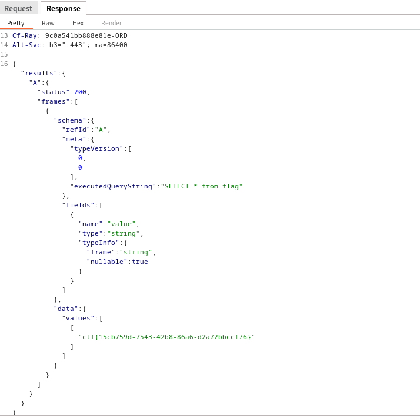

# Dashboard

## Challenge

You are given access to a Grafana instance with a single dashboard panel.  
The panel displays only a simple table, and UI editing is disabled.

## Solution

Even though the panel editor is locked, Grafana still exposes the panel’s query via its API.

Opening the panel query inspector shows: `rawsql: "select affiliation_type, count(affiliation_type) from affiliations group by affiliation_type"`.

Since the UI prevents editing, the next step is to look at how the data is fetched.

Under the **Query** inspector, the request is made through: `POST /api/ds/query`



By replicating this POST request manually (e.g., in the browser devtools console or using a tool like cURL or Postman), you can replace the `rawSql` query with your own (I used Burpsuite).

To enumerate all tables:

```json
"rawSql":"SELECT table_name FROM information_schema.tables WHERE table_schema = 'public';"
```

This returns a large list of tables — including one named flag.

To retrieve the flag, send another POST request with:

```json
"rawSql":"SELECT * from flag"
```
This query returns the flag directly in the response.

