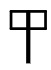
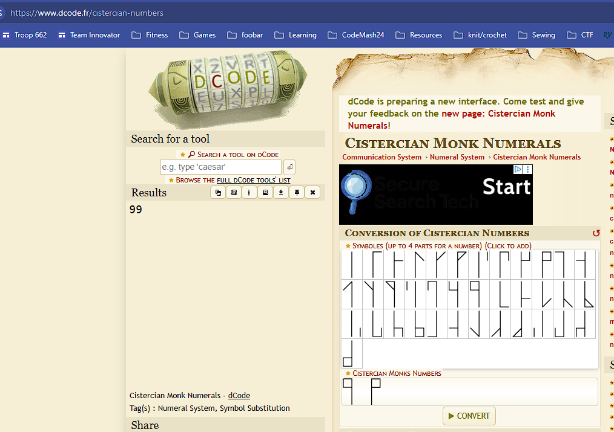

# Monky business

## Challenge

## Solution

The title intentionally uses **“monky”** instead of **“monkey.”** Googling *monk encoding* leads to **Cistercian numerals**, a monastic numbering system used in medieval Europe.

Reference:  
https://en.wikipedia.org/wiki/Cistercian_numerals

Using dcode's [Cistercian Numbers decoder](https://www.dcode.fr/cistercian-numbers), we can reconstruct each symbol.

For example,  breaks down into two symbol components which the decoder returns as 99:

The lowercase c has decimal ASCII value 99.

Repeating this process for every glyph yields the sequence:

`99 116 102 { 111 109 101 103 97 - 102 108 117 120 - 99 97 114 100 - 112 108 117 115 }`

Interpreting these as ASCII codes gives:

`CTF{OMEGA-FLUX-CARD-PLUS}`
