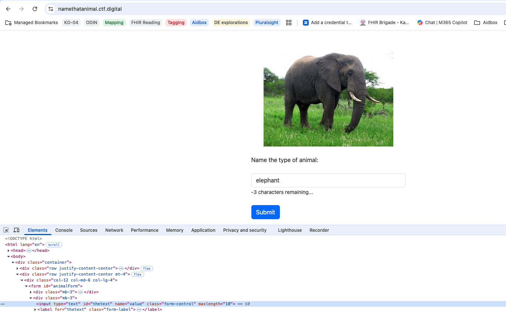
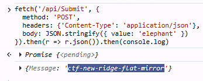

# Name That Animal

## Challenge

**“It’s simple, just submit the name of the animal in the photo.”**

The page displays a picture of an elephant and a text field where you're supposed to type the animal’s name.  

Submitting the correct name *should* return the flag.


However, the input box only allows **5 characters**, making it impossible to type “elephant.”

## Solution

The length restriction was enforced **client‑side only**.

The form had this restriction:

```html
<input maxlength="5">
```

Removing or adjusting it allowed typing the full word, but submission still failed — nothing happened when clicking the Submit button:



Even after removing the max length, the JavaScript validation still blocked the request. The client code checked the input length before sending it to the server:

```javascript
form.addEventListener('submit', async function(e) {
    ...

    if(value.length > 5) {
        responseMessage.textContent = 'Input exceeds maximum length of 5 characters.';
        return;
    }

    try {
        const response = await fetch('/api/Submit', {
            method: 'POST',
            headers: {
                'Content-Type': 'application/json',
            },
            body: JSON.stringify({ value: value })
        });
    ...
}
```

To bypass this, I simply executed the *same fetch request* directly in the browser console, skipping all client-side checks:

```javascript
fetch('/api/Submit', {
    method: 'POST',
    headers: {
        'Content-Type': 'application/json',
    },
    body: JSON.stringify({value: 'elephant'})
}).then(r=>r.json().then(console.log))
```



This bypasses the JavaScript validation and sends the full value to the server, which returns the flag:
`ctf{new-ridge-flat-mirror}`
